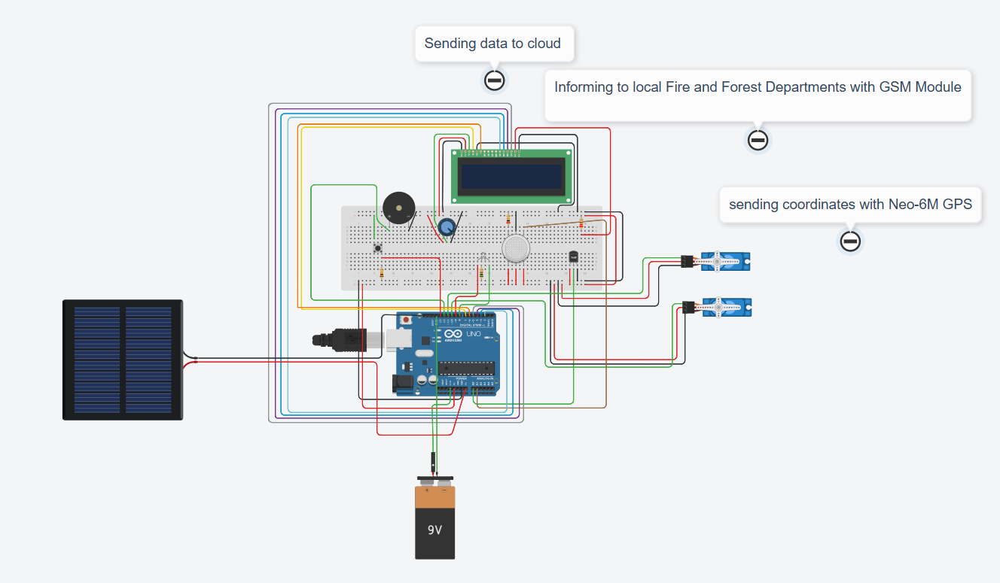

# 🌲 Forest Fire Detection System 🚒

This is a smart forest fire detection and alerting system using Arduino UNO R3, equipped with GSM and GPS modules, a DHT sensor, and more. The system alerts the forest and fire departments when it detects abnormal temperature/humidity or fire events.

## 🔧 Components Used

- Arduino UNO R3
- DHT11 Sensor
- NEO-6M GPS Module
- GSM Module (SIM800L)
- LCD Display (16x2)
- Buzzer
- Solar Panel (for power)
- 9V Battery (backup power)
- Resistors, jumper wires, breadboard

## ⚙️ Functionality

- 🔥 Detects fire and abnormal temperatures
- 📡 Sends real-time location using GPS
- 📲 Alerts local authorities using GSM
- ☁️ Can send data to cloud services (optional)

## 📷 Circuit Diagram

## 📄 Arduino Code

Check the `ArduinoCode/forest_fire_detection.ino` file for complete source code.

## 💡 Future Enhancements

- Add cloud dashboard (ThingSpeak/Firebase)
- Replace breadboard with PCB
- Add camera module for visual confirmation

